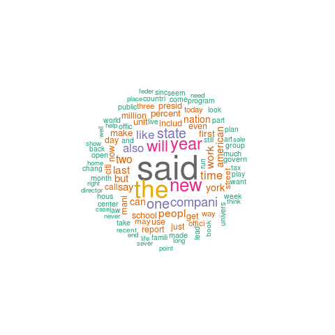
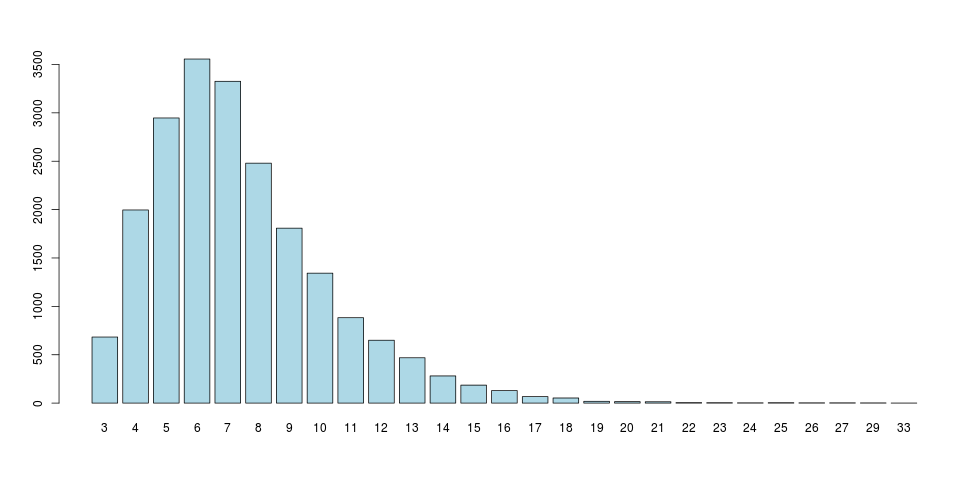
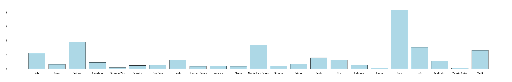
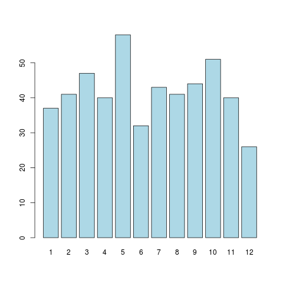

# Report

**说明** 由于错误地以为这次作业是小组作业，所以本次作业为分工合作完成。  
----王栋  王倩

## 数据预处理与可视化

### 新闻数据的读入与建立数据框对象

* 此部分使用XML包
* 核心部分为用xpathSApply解析XML文件，提取需要的数据


* 数据框（缺失数据用NA填充）
  * 文件名
  * 年
  * 月
  * 日
  * 分类（多个分类之间用“/”分隔，整体为字符串）
  * 全文（数据框中全文未进行预处理）
* 生成的数据框保存到“dataframe.csv"中

### 对新闻全文进行预处理

* 此部分使用NLP、tm包
* 核心部分为建立语料库Corpus以及用tm_map进行预处理
* 处理内容
  * 标点符号
  * 停用词
  * 数字
  * 空白字符
  * 将大写转换为小写
  * 词干化处理
* 预处理的全文存储在新生成的'Pre'文件夹下，按照dataframe中文件顺序分别为1.txt到500.txt

### 将每一篇新闻的全文表示成 BagOfWords 向量。

* 此时新闻全文为预处理后全文
* 核心部分为```TermDocumentMatrix(reuters)``` 建立BOW向量
* 由于生成的矩阵过大，生成的文件很难打开，如果希望看到结果建议运行玩代码后执行```View(m)``` ，此处放如部分截图

### 单词在所有新闻中出现的次数

* 出现次数超过100的词
  * 根据生成的BOW向量，取出现次数大于100的单词
  * 将次数大于100的单词存储在’wordfilter.csv‘中
* 给出出 现 次 数 最 多 的 100 个 词 并 对 这 些 词 画 出 “ 云 图 ”
  * 此部分使用RColorBrewer、wordcloud包

  * 生成的云图为’wordcloud.png‘

    

### 单词长度的分布情况

* 单词长度的分布
  * 此部分使用ggplot2包



### 每一类别下新闻数量的分布情况

* 每一类别下的新闻数量
  * 此部分使用ggplot2包



### 每个月新闻数量的分布情况

* 每个月新闻数量的分布情况
  * 此部分使用ggplot2包



## 新闻相似度计算

### 计算新闻之间的余弦相似度矩阵
+ 直接使用公式计算，结果为上三角矩阵

### 类别内新闻的平均相似度
+ 首先计算每个类别下的新闻id列表class_list
+ 然后对每个类别内的新闻进行排列组合计算cosine_similarity再求均值

### 两个类别的平均相似度
+ 将所有类别A与类别B中的新闻组合的相似度累加（若A有a条新闻，B有b条新闻，则需要累加a*b个相似度值），再除以a*b
